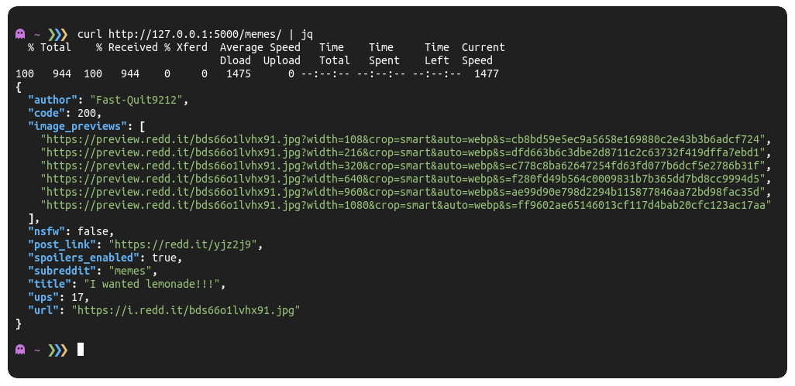

<div align="center">
    <h1>
        <s>Shitty</s> Reddit API
    </h1>
    <p align="center">
        A <s>shitty</s> unofficial Reddit API to retrieve posts from <strong>SPECIFIC</strong> subreddits.
    </p>
    
</div>

## How it works

This API uses Praw to retrieve the data and the Flask web framework to display the data in **JSON** format.
To get a **RANDOM** post from a **SPECIFIC** subreddit you'll have to provide the subreddit a the endpoint of the url.

**NOTE**: This API is meant to be hosted locally.

### Example

To get a random post from the [`r/memes`](https://www.reddit.com/r/memes/) subreddit you'll have to navigate to the following URL.

- **Endpoint**: `/memes`
- **Full URL**: [http://127.0.0.1:5000/memes/](http://127.0.0.1:5500/memes/)
- **Returns**:

```json
{
  "author": "Fast-Quit9212",
  "code": 200,
  "image_previews": [
    "https://preview.redd.it/bds66o1lvhx91.jpg?width=108&crop=smart&auto=webp&s=cb8bd59e5ec9a5658e169880c2e43b3b6adcf724",
    "https://preview.redd.it/bds66o1lvhx91.jpg?width=216&crop=smart&auto=webp&s=dfd663b6c3dbe2d8711c2c63732f419dffa7ebd1",
    "https://preview.redd.it/bds66o1lvhx91.jpg?width=320&crop=smart&auto=webp&s=c778c8ba62647254fd63fd077b6dcf5e2786b31f",
    "https://preview.redd.it/bds66o1lvhx91.jpg?width=640&crop=smart&auto=webp&s=f280fd49b564c0009831b7b365dd7bd8cc9994d5",
    "https://preview.redd.it/bds66o1lvhx91.jpg?width=960&crop=smart&auto=webp&s=ae99d90e798d2294b115877846aa72bd98fac35d",
    "https://preview.redd.it/bds66o1lvhx91.jpg?width=1080&crop=smart&auto=webp&s=ff9602ae65146013cf117d4bab20cfc123ac17aa"
  ],
  "nsfw": false,
  "post_link": "https://redd.it/yjz2j9",
  "spoilers_enabled": true,
  "subreddit": "memes",
  "title": "I wanted lemonade!!!",
  "ups": 17,
  "url": "https://i.redd.it/bds66o1lvhx91.jpg"
}
```

## How to install

You can install te bot by entering the following commands in your terminal:

```bash
$ git clone https://github.com/AntonVanAssche/RedditAPI.git # Clone the repository
$ cd RedditAPI # Go to the directory
$ pip3 install -r requirements.txt # Install dependencies
```

Once you have successfully cloned the project and installed the dependencies, you'll have to create a `.env` file with your Reddit credentials. 
You can generate a token in [Reddit preferences](https://old.reddit.com/prefs/apps) under `create another app`.

```
CLIENT_ID='YOUR CLIENT ID'
CLIENT_SECRET='YOUR CLIENT SECRET'
USER_AGENT='Comment Extraction (by /u/YOUR_REDDIT_USERNAME)'
```

Once you have successfully configured the `.env` file, you can start the API by running the following command in your terminal:

```bash
$ python src/main.py
```

That's it!.
If you encountered any issues while installing the API, feel free to [report them here](https://github.com/AntonVanAssche/RedditAPI/issues/new).

## References

- [PRAW Documentation](https://praw.readthedocs.io/en/stable/index.html)
- [Flask Documentation](https://flask.palletsprojects.com/en/2.2.x/)
- [python-dotenv Documentation](https://github.com/theskumar/python-dotenv#getting-started)
